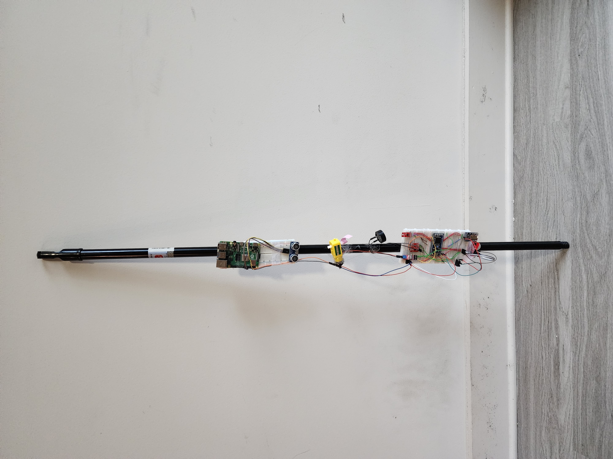
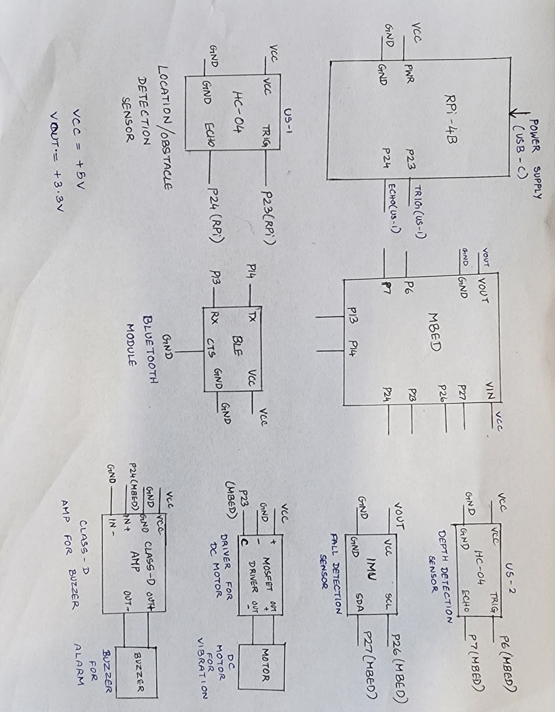
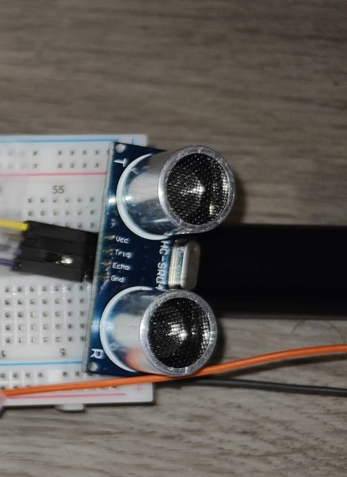
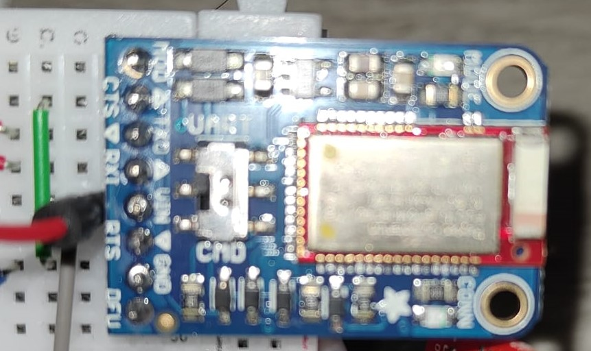
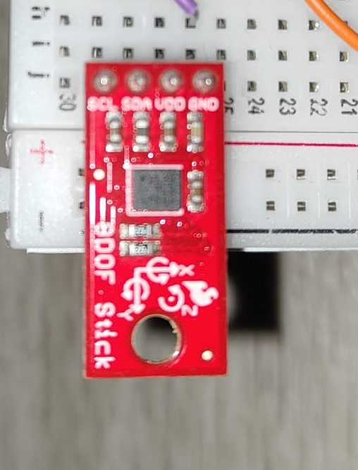
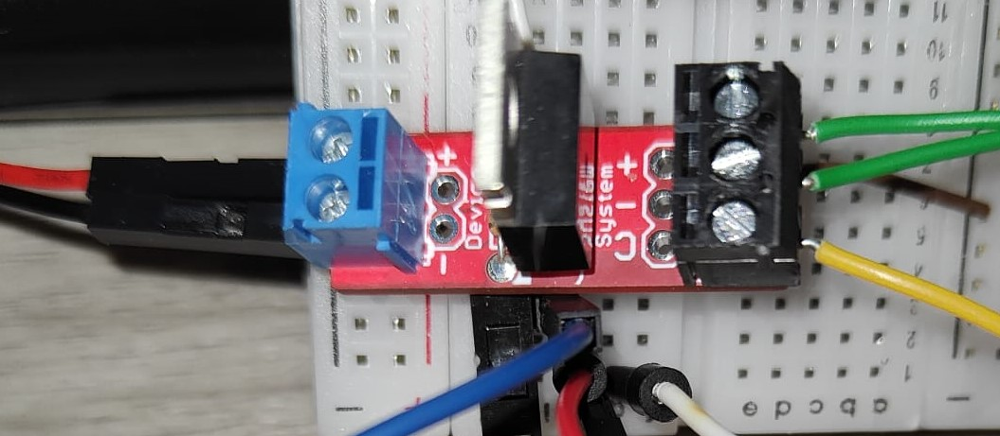
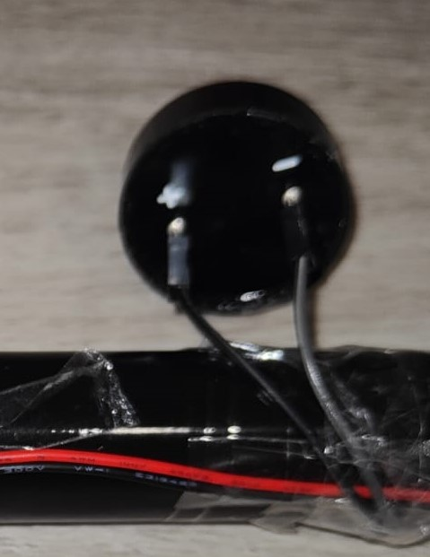
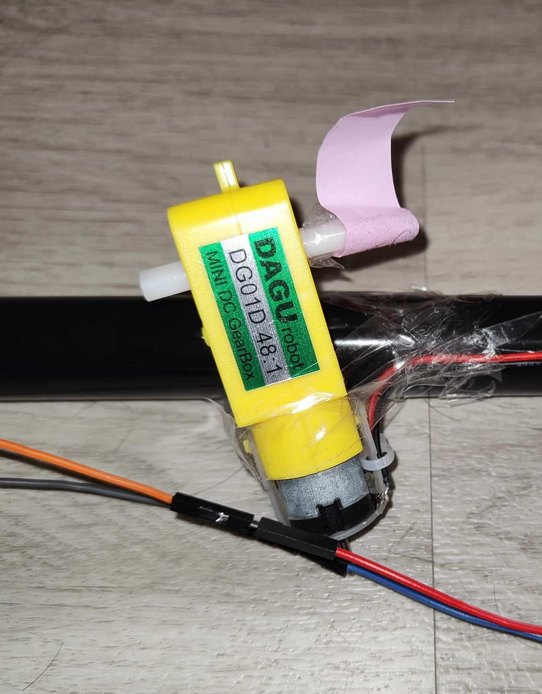

# ECE_4180_Smart_Walking_Stick
The repository contains details about the implementation of the smart walking stick for visually impaired or old people.
The main objective of the project is to develop a prototype of a smart walking stick to assist visually impaired and old people to move around as independently as possible. The smart stick has the following features:
* Haptic feedback is sent to user based on real-time measurements of obstacles from **ultrasonic sensors**.
* Additionally the real time distance is also conveyed to the user using **TEXT-TO-SPEECH** on a **Raspberry Pi**.
* The stick can also detect terrain differences such as sudden slope, staircases etc alerting the user with the help of **Ultrasonic sensor**.
* A simple **fall detection** mechanism using IMU sensor data ,alerting using a speaker when the user encounters a fall. 
* The stick has two modes:                                                                                                                               
        1. **Companion mode**: Helps the user navigate with the data from above mentioned sensors.                                                                     
        2. **Location mode** : Continuously emits a sound via speaker when the user presses the key via Bluefruit Connect.
        
<p align="center">
    
</p>

## HARDWARE COMPONENTS
1. Mbed - LPC1768
2. Raspberry Pi 4B
3. Ultrasonic sensor
4. Adafruit Bluetooth module
6. LSM9DS1 IMU sensor
7. DC Motor
8. MOSFET motor driver
9. Buzzer/speaker
10. Class D amplifier


## SOFTWARE
1. Embedded C
2. Python
	

## SCHEMATIC

<p align="center">

</p>

## WORKING/ OPERATION

###  ULTRASONIC SENSOR 

Ultrasonic Sensor Pin Lookup

| Mbed     | HC-SR04  |
| -------  | -------- |
| Vu (5V)  | Vcc      | 
| Gnd	   | Gnd      |
| p6	   | trig     |
| p7	   | echo     |

* Ultrasonic sensor works with the help of trigger and echo signals. 
* Initally trigger pin sends out an ultrasonic signal and the echo pin waits to receive the signal back. 
* The distance can be calculated by measuring the width of the echo distance. 
* Typically a hardware timer is needed but simple divide operation can calibrate the sensor to obtain real time measurement values.
* Wait time of 500 ms is added to ensure that the device can receive longest possible time for echo to return and hence avoiding any collision between the previous and the next signal.
* We have used two ultrasonic sensors in our project. One is to detect the obstacles in front of the user and the other sensor is used as a depth sensor which can detect stairs/holes in the path.


<p align="center">
    
</p>

#### Code Snippet:
```
float distance_ultra; 
void dist(int distance)
{
    distance_ultra = distance*32*30/10000;
}
ultrasonic mu(p6, p7, .1, 1, &dist);
void thread3(void const* args){ 
    { 
	mu.checkDistance();  
        Thread::wait(500);  
   } 
```


### ADAFRUIT Bluetooth Module

Adafruit Bluetooth  Pin Lookup

| Mbed            | Adafruit BLE   |
| --------------  | -------------  |
| Gnd             | Gnd            |
| VU (5V)         | Vin (3.3-1.6V) |
| nc              | RTS            |
| Gnd             | Gnd            |
| P14 (Serial RX) | TXO            |
| P13 (Serial TX) | RXI            |

* The Adafruit Bluefruit BLE board features an ARM Cortex M0 core running at 16MHz with 256KB flash memory and 32KB SRAM
* The Bluefruit LE UART Friend makes it easy to add Bluetooth Low Energy connectivity
to anything with a hardware or software serial port.
* Bluefruit App has a color picker, quaternion/accelerometer/gyro/magnetometer or location (GPS) (), and an 8-button control game pad ().
* We have used 8-button control game pad for locate mode for our project. Through bluetooth we will give command to switch on/off buzzer.


<p align="center">
    
</p>

#### Code Snippet:
```
void thread3(void const* args)
{   // This thread waits for input command from Bluefruit app, based on the input it will switch on/off the buzzer
    char bnum;
    while (true)
    {
        if (blue.readable()) {
            Serial_mutex.lock();
            if (blue.getc() == '!') {
                if (blue.getc() == 'B') { //button data
                    bnum = blue.getc(); //button number
                }
            }
            if (bnum == '4') {
                locate_mode = true;
            }
            else if (bnum == '3')
            {
                locate_mode = false;
            }
            Serial_mutex.unlock(); Thread::wait(700);
        }
        if (locate_mode == true)
            buzzer = true;
        else
            buzzer = false;
    }

}
```


### LSM9DS1 IMU sensor

LSM9DS1 I2C Pin Lookup

| Pin on Breakout | Pin on Mbed    |
| --------------  | -------------  |
| Gnd             | Gnd            |
| VDD	          | Vout           |
| SDA	          | p9 (SDA)       |
| SCL             | p10 (SCL)      |

This sensor used I2C protocol for communication

*   Inter-Integrated Circuit (I2C) Protocol is a protocol intended to allow multiple "peripheral" digital integrated circuits ("chips") to communicate with one or more "controller" chips.
*  It is only intended for short distance communications within a single device.
*  It only requires two signal wires to exchange information. SDA (Serial Data) is the data signal and SCL (Serial Clock) is the clock signal. 
*  Each signal line has a pull-up resistor on it, to restore the signal to high when no device is asserting it low.
*  I2C  can be used with short runs of wire (2-3m)

Sensor description:

*  The LSM9DS1 is motion-sensing soc. It has a 3-axis accelerometer, 3-axis gyroscope, and 3-axis magnetometer and nine degrees of freedom (9DOF).
*  It measures its acceleration in g's, and its scale can be set to either ± 2, 4, 8, or 16 g.
*  It measure three key properties of movement – angular velocity, acceleration, and heading.
*  We have used IMU sensor for fall detection. When there is high acceleration , that is sudden change in velocity, we will activate the Digital Out Pin p24 where buzzer is connected, indicating that stick/person has fallen.


<p align="center">
    
</p>

#### Code Snippet:
```
    while (1)
    {
        float thresh_mag = 1.2;        
        imu.readAccel();
        float ax = imu.calcAccel(imu.ax);
        float ay = imu.calcAccel(imu.ay);
        float az = imu.calcAccel(imu.az);

        float accel_mag = ax * ax + ay * ay + az * az;
        
        if (accel_mag > thresh_mag) // If there is a acceleration beyond the threshold magnitude, fall is detected
        {
            has_fallen = true;

        }
        else
            has_fallen = false;
```


### MOSFET DRIVER 
Mosfet Driver Pin Lookup
|Mbed	  | MOSFET PCB     | External Device  |
|------   | -----------    | ---------------  |
| gnd	  | JP2-2 gnd	   |                  |
| 5V	  | JP2-1 RAW	   |                  |
| P23     | JP2-3 Control  |	              |
|         |	JP1-1      |   Device(neg)    |
|     	  |     JP1-2      |   Device(pos)    |

*  p23 digital out pin can be used for control, connects to the control input of the driver circuit. 
* Mbed can only supply about 200mA of current for external devices via USB power, so an external DC power supply is needed for large loads.
* MOSFET has a very low gate input voltage that works with 3.3V logic signals like those on mbed.
* MOSFET driver ICs such as the LTC1155 use a charge pump circuit to drive the gate voltage higher on higher voltage MOSFET driver circuits using a normal digital logic level control signal (i.e., useful when load voltage (RAW in schematic) is larger then the logic supply voltage). 


<p align="center">
    
</p>


### BUZZER AND CLASS D AMPLIFIER 
Buzzer and Class D amplifier Pin Lookup
|Mbed	             |TPA2005D1             |Speaker
|-----------------   |-----------------     |------------
|Gnd	             |pwr - (gnd), in -     |	
|Vout (3.3V) or 5V   |pwr +	            |
|p24 (PWM)           |in +	            |
|                    |out+	            | +
|                    |out	-	    | -

Buzzer: 

*  p24 digital pin is connected to buzzer.
*  Buzzer is used for two applications in our prototype. a) For fall detection and b) Locating the stick.
*  When sudden fall is detected with the help of values from IMU, the buzzer is set to 1 - Fall detection
*  8-button control game pad in bluefruit App is used to switch on/off the buzzer. The sound emitted by the buzzer can be used to locate the stick.


<p align="center">
 
</p>

####  Code Snippet:
```
        if (buzzer == true || has_fallen == true)
        {
            buzz = 0.5;
            Thread::wait(500);
            buzz = 0.0;
        }
        else
            buzz = 0;
    }
```

TPA2005D1 Class D Audio Amplifier

*   TI TPA2005D1 is a 1.4-W mono filter-free class D audio power amplifier with a differential input.
*   Class D amplifiers use PWM for power efficiency. It uses a 250 kHz PWM output with an H-bridge output driver to drive a small speaker.
*   The audio passes through a simple low-pass filter into the loudspeaker. The high-frequency pulses are blocked. 
*   The pairs of output transistors never conduct at the same time, there is no other path for current flow apart from the low-pass filter/loudspeaker,due to this    efficiency can exceed 90%. 

<p align="center">

</p>

### Raspberry Pi 4 Model B 


*   We have used Raspberry Pi 4 for text to speech with the help of PYTTX and espeak.
*   The real time sonar distance is sent as a voice signal to user through earphones after delay of every 4 secs.
<p align="center">

</p>

```
import RPi.GPIO as GPIO
import time
import pyttsx3

engine = pyttsx3.init()
GPIO.setmode(GPIO.BCM)

TRIG = 23
ECHO = 24

print ("Started TTS")
while 1:
    GPIO.setmode(GPIO.BCM)
    GPIO.setup(TRIG,GPIO.OUT)
    GPIO.setup(ECHO,GPIO.IN)

    GPIO.output(TRIG, False)
    time.sleep(2)

    GPIO.output(TRIG, True)
    time.sleep(0.00001)
    GPIO.output(TRIG, False)

    while GPIO.input(ECHO)==0:
        pulse_start = time.time()

    while GPIO.input(ECHO)==1:
        pulse_end = time.time()
    pulse_duration = pulse_end - pulse_start

    distance = pulse_duration * 17150

    distance = round(distance, 2)

    alert_str = "Distance is " + str(distance)
    print("Distance:",distance,"cm")        
    engine.say(alert_str)
    engine.runAndWait()
    time.sleep(2)
    GPIO.cleanup()
```


### Motor

*   We have used motor to give haptic feedback based on the distance measured by the depth measuring sonar.
*   The duty cycle of PWM signal which drives the motor increases with increase in the difference between the distance measured by the sonar and threshold distance.
*   So, as the distance increases, the speed at which motor rotates increases.
<p align="center">

</p>

```
void thread2(void const* args) 
{ // This thread assigns a PWM output which is scaled based on the distance between ultrasonic sonic sensor and obstacle to the motor
  // This thread run after every 1 sec
    while (1)
    {
        if (distance_ultra > 40 && distance_ultra < 100)
        {
            vibration = (distance_ultra - 40) / 60;// Calibrating value for haptic feedback
            mymotor = vibration;  // to be based on distance  
        }
        else
        {
            vibration = 0;
            mymotor = vibration;
        }
        Thread::wait(1000);
    }
}
```

### Future Work
	
* When fall is detected, the code can be automated to send a SOS message to emergency contact using GPS module via NodeRed.
* Maps feature can be added, with data from GPS module which will enable user to navigate more accurately.
* During locate mode, the user could get the exact location of the stick in his phone.
	

### Authors
	
* Anand Murali    -- amurali73@gatech.edu
* Aakash Venkataraman  -- avenkata44@gatech.edu
* Sibi Renganatth Sudhakar -- ssudhakar32@gatech.edu 
* Prateeksha Giri -- pgiri8@gatech.edu
	

	
	


